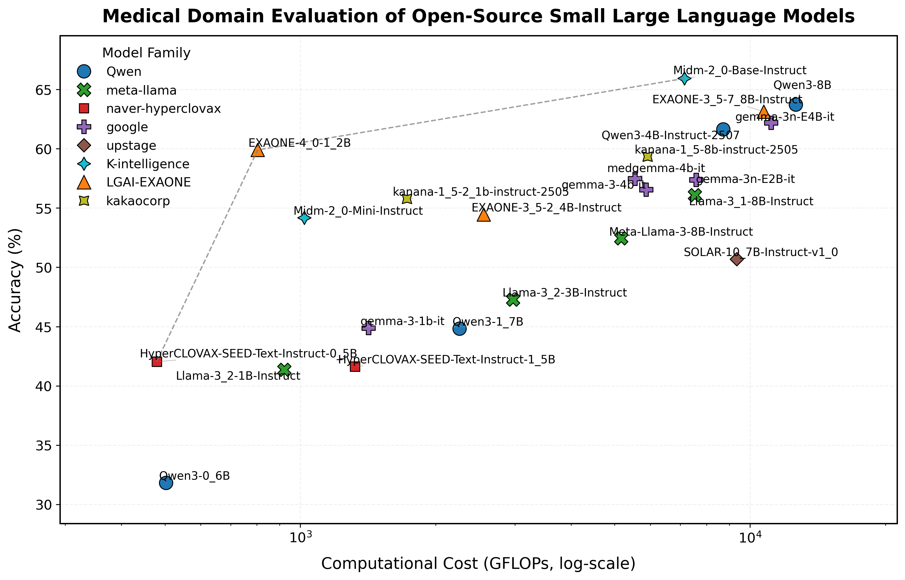
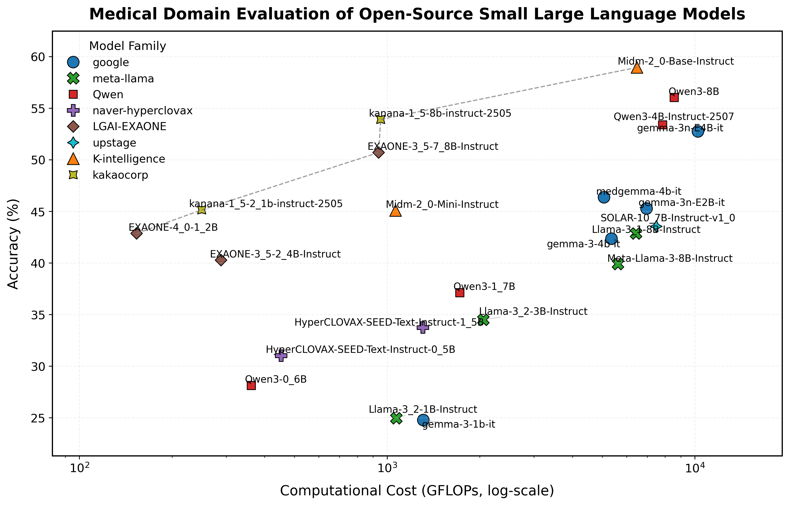
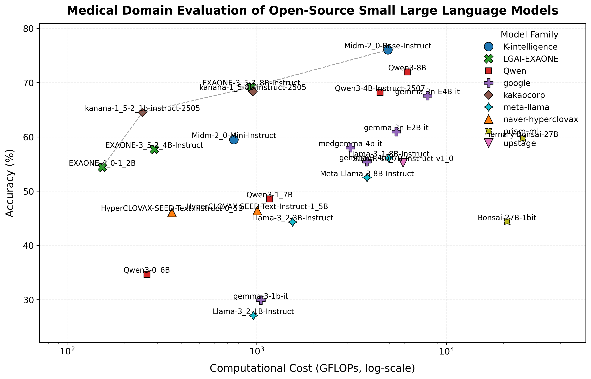
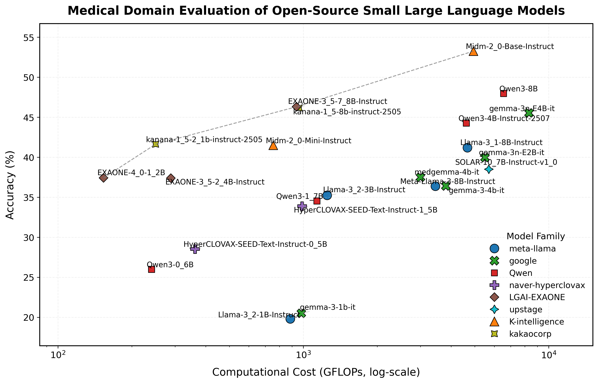
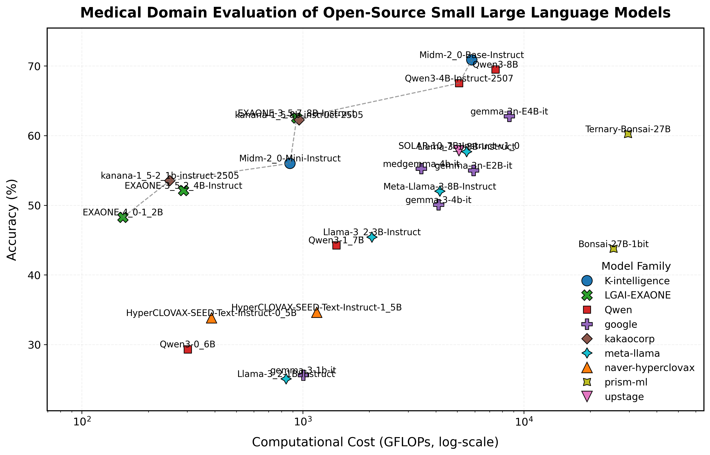
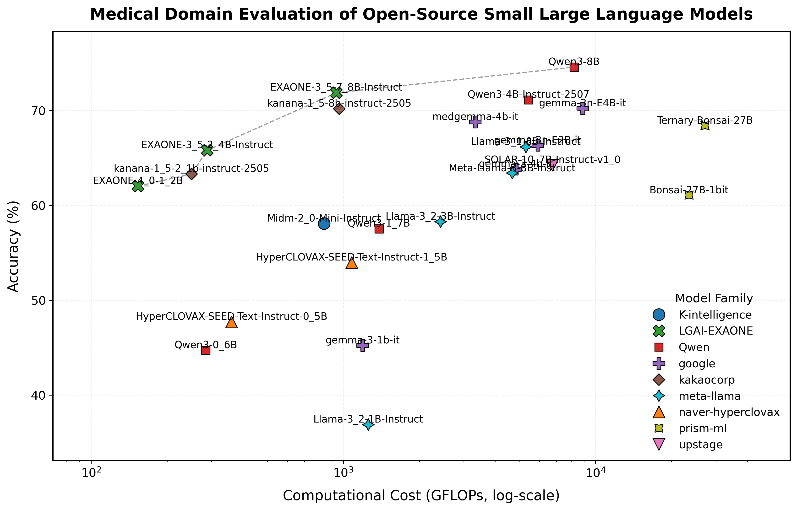
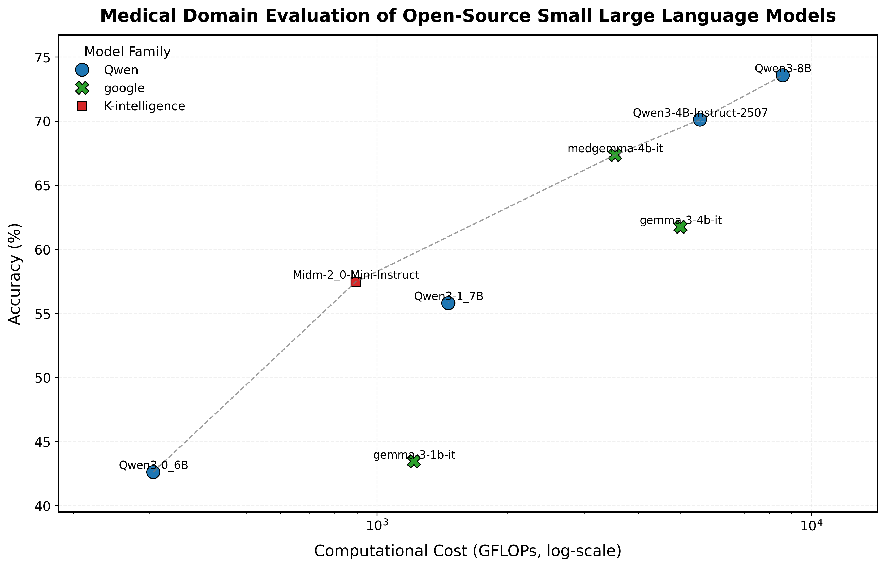

# Kor_MedQA_Benchmark

A comprehensive benchmark for evaluating Large Language Models (LLMs) on Korean medical question-answering datasets.

## 📋 Overview

Kor_MedQA_Benchmark is a systematic evaluation framework for assessing the performance of Large Language Models (LLMs) on Korean medical question-answering (QA) datasets. This benchmark supports multiple medical QA datasets and a wide range of LLM models, enabling comprehensive evaluation of model capabilities in the Korean medical domain.

## 📈 Benchmark Results Update 
The following tables show benchmark results for each dataset, including accuracy, average time per token, and mean FLOPs.



<details>
<summary><b>SNUH ClinicalQA</b> (Click to expand)</summary>


| model_group | model_name | accuracy (%) | avg_time_per_token (s) | mean_flops (GFlops) |
|----|----|----|----|----|
| K-intelligence | Midm-2_0-Mini-Instruct | 54.17 | 0.024 | 1021.289 |
| K-intelligence | Midm-2_0-Base-Instruct | 65.93 | 0.379 | 7150.807 |
| LGAI-EXAONE | EXAONE-3_5-2_4B-Instruct | 54.45 | 0.016 | 2558.394 |
| LGAI-EXAONE | EXAONE-4_0-1_2B | 59.9 | 0.015 | 804.151 |
| LGAI-EXAONE | EXAONE-3_5-7_8B-Instruct | 63.12 | 0.385 | 10731.36 |
| Qwen | Qwen3-0_6B | 31.81 | 0.009 | 503.082 |
| Qwen | Qwen3-1_7B | 44.82 | 0.009 | 2260.466 |
| Qwen | Qwen3-4B-Instruct-2507 | 61.63 | 0.014 | 8721.133 |
| Qwen | Qwen3-8B | 63.72 | 0.021 | 12645.159 |
| google | gemma-3-1b-it | 44.88 | 0.013 | 1417.647 |
| google | gemma-3-4b-it | 56.56 | 0.024 | 5873.3 |
| google | gemma-3n-E2B-it | 57.38 | 0.031 | 7587.798 |
| google | medgemma-4b-it | 57.48 | 0.016 | 5546.164 |
| google | gemma-3n-E4B-it | 62.2 | 0.032 | 11133.553 |
| kakaocorp | kanana-1_5-2_1b-instruct-2505 | 55.77 | 0.013 | 1726.833 |
| kakaocorp | kanana-1_5-8b-instruct-2505 | 59.33 | 0.028 | 5920.449 |
| meta-llama | Llama-3_2-1B-Instruct | 41.35 | 0.006 | 921.685 |
| meta-llama | Llama-3_2-3B-Instruct | 47.27 | 0.014 | 2973.008 |
| meta-llama | Meta-Llama-3-8B-Instruct | 52.44 | 0.02 | 5171.75 |
| meta-llama | Llama-3_1-8B-Instruct | 56.08 | 0.024 | 7541.13 |
| naver-hyperclovax | HyperCLOVAX-SEED-Text-Instruct-1_5B | 41.63 | 0.01 | 1322.43 |
| naver-hyperclovax | HyperCLOVAX-SEED-Text-Instruct-0_5B | 42.04 | 0.011 | 479.408 |
| upstage | SOLAR-10_7B-Instruct-v1_0 | 50.68 | 0.033 | 9346.172 |

</details>

<details>
<summary><b>KorMedMCQA - Doctor</b> (Click to expand)</summary>



| model_group | model_name | accuracy (%) | avg_time_per_token (s) | mean_flops (GFlops) |
|----|----|----|----|----|
| K-intelligence | Midm-2_0-Mini-Instruct | 45.08 | 0.014 | 1065.253 |
| K-intelligence | Midm-2_0-Base-Instruct | 58.94 | 0.367 | 6482.057 |
| LGAI-EXAONE | EXAONE-3_5-2_4B-Instruct | 40.27 | 0.009 | 288.622 |
| LGAI-EXAONE | EXAONE-4_0-1_2B | 42.86 | 0.011 | 153.495 |
| LGAI-EXAONE | EXAONE-3_5-7_8B-Instruct | 50.7 | 0.02 | 938.235 |
| Qwen | Qwen3-0_6B | 28.13 | 0.01 | 361.69 |
| Qwen | Qwen3-1_7B | 37.12 | 0.01 | 1719.952 |
| Qwen | Qwen3-4B-Instruct-2507 | 53.39 | 0.015 | 7851.507 |
| Qwen | Qwen3-8B | 56.03 | 0.025 | 8561.902 |
| google | gemma-3-1b-it | 24.78 | 0.02 | 1310.785 |
| google | gemma-3-4b-it | 42.35 | 0.027 | 5356.819 |
| google | gemma-3n-E2B-it | 45.27 | 0.03 | 6964.839 |
| google | medgemma-4b-it | 46.36 | 0.027 | 5065.83 |
| google | gemma-3n-E4B-it | 52.74 | 0.045 | 10228.387 |
| kakaocorp | kanana-1_5-2_1b-instruct-2505 | 45.14 | 0.012 | 249.837 |
| kakaocorp | kanana-1_5-8b-instruct-2505 | 53.9 | 0.022 | 953.033 |
| meta-llama | Llama-3_2-1B-Instruct | 24.95 | 0.006 | 1071.578 |
| meta-llama | Llama-3_2-3B-Instruct | 34.49 | 0.011 | 2054.402 |
| meta-llama | Meta-Llama-3-8B-Instruct | 39.89 | 0.02 | 5624.172 |
| meta-llama | Llama-3_1-8B-Instruct | 42.85 | 0.02 | 6438.361 |
| naver-hyperclovax | HyperCLOVAX-SEED-Text-Instruct-0_5B | 31.03 | 0.019 | 452.043 |
| naver-hyperclovax | HyperCLOVAX-SEED-Text-Instruct-1_5B | 33.75 | 0.011 | 1305.735 |
| upstage | SOLAR-10_7B-Instruct-v1_0 | 43.54 | 0.127 | 7490.88 |

</details>

<details>
<summary><b>KorMedMCQA - Nurse</b> (Click to expand)</summary>



| model_group | model_name | accuracy (%) | avg_time_per_token (s) | mean_flops (GFlops) |
|----|----|----|----|----|
| K-intelligence | Midm-2_0-Mini-Instruct | 59.49 | 0.024 | 758.584 |
| K-intelligence | Midm-2_0-Base-Instruct | 76.05 | 0.177 | 4922.429 |
| LGAI-EXAONE | EXAONE-4_0-1_2B | 54.39 | 0.01 | 153.503 |
| LGAI-EXAONE | EXAONE-3_5-2_4B-Instruct | 57.7 | 0.009 | 288.623 |
| LGAI-EXAONE | EXAONE-3_5-7_8B-Instruct | 69.21 | 0.019 | 938.152 |
| Qwen | Qwen3-0_6B | 34.67 | 0.01 | 263.681 |
| Qwen | Qwen3-1_7B | 48.57 | 0.01 | 1169.293 |
| Qwen | Qwen3-4B-Instruct-2507 | 68.2 | 0.017 | 4470.038 |
| Qwen | Qwen3-8B | 71.99 | 0.026 | 6230.448 |
| google | gemma-3-1b-it | 29.91 | 0.012 | 1050.925 |
| google | gemma-3-4b-it | 55.44 | 0.019 | 3808.851 |
| google | medgemma-4b-it | 58.03 | 0.019 | 3118.958 |
| google | gemma-3n-E2B-it | 60.98 | 0.031 | 5448.569 |
| google | gemma-3n-E4B-it | 67.61 | 0.035 | 7955.184 |
| kakaocorp | kanana-1_5-2_1b-instruct-2505 | 64.5 | 0.013 | 249.916 |
| kakaocorp | kanana-1_5-8b-instruct-2505 | 68.38 | 0.021 | 955.162 |
| meta-llama | Llama-3_2-1B-Instruct | 27.06 | 0.006 | 961.226 |
| meta-llama | Llama-3_2-3B-Instruct | 44.3 | 0.01 | 1548.123 |
| meta-llama | Meta-Llama-3-8B-Instruct | 52.51 | 0.02 | 3820.289 |
| meta-llama | Llama-3_1-8B-Instruct | 56.1 | 0.02 | 4976.065 |
| naver-hyperclovax | HyperCLOVAX-SEED-Text-Instruct-0_5B | 46.07 | 0.012 | 357.542 |
| naver-hyperclovax | HyperCLOVAX-SEED-Text-Instruct-1_5B | 46.42 | 0.011 | 1007.87 |
| upstage | SOLAR-10_7B-Instruct-v1_0 | 55.23 | 0.107 | 5916.325 |

</details>

<details>
<summary><b>KorMedMCQA - Dentist</b> (Click to expand)</summary>



| model_group | model_name | accuracy (%) | avg_time_per_token (s) | mean_flops (GFlops) |
|----|----|----|----|----|
| K-intelligence | Midm-2_0-Mini-Instruct | 41.5 | 0.024 | 754.454 |
| K-intelligence | Midm-2_0-Base-Instruct | 53.26 | 0.212 | 4936.211 |
| LGAI-EXAONE | EXAONE-3_5-2_4B-Instruct | 37.39 | 0.009 | 288.578 |
| LGAI-EXAONE | EXAONE-4_0-1_2B | 37.42 | 0.01 | 153.418 |
| LGAI-EXAONE | EXAONE-3_5-7_8B-Instruct | 46.31 | 0.019 | 938.139 |
| Qwen | Qwen3-0_6B | 25.99 | 0.01 | 240.732 |
| Qwen | Qwen3-1_7B | 34.54 | 0.01 | 1136.262 |
| Qwen | Qwen3-4B-Instruct-2507 | 44.28 | 0.017 | 4617.21 |
| Qwen | Qwen3-8B | 47.98 | 0.026 | 6542.45 |
| google | gemma-3-1b-it | 20.5 | 0.012 | 981.757 |
| google | gemma-3-4b-it | 36.41 | 0.019 | 3807.923 |
| google | medgemma-4b-it | 37.5 | 0.019 | 3003.648 |
| google | gemma-3n-E2B-it | 39.96 | 0.027 | 5498.117 |
| google | gemma-3n-E4B-it | 45.53 | 0.031 | 8312.049 |
| kakaocorp | kanana-1_5-2_1b-instruct-2505 | 41.63 | 0.013 | 250.154 |
| kakaocorp | kanana-1_5-8b-instruct-2505 | 46.16 | 0.021 | 960.794 |
| meta-llama | Llama-3_2-1B-Instruct | 19.8 | 0.006 | 885.209 |
| meta-llama | Llama-3_2-3B-Instruct | 35.24 | 0.011 | 1251.159 |
| meta-llama | Meta-Llama-3-8B-Instruct | 36.38 | 0.02 | 3454.987 |
| meta-llama | Llama-3_1-8B-Instruct | 41.19 | 0.02 | 4666.221 |
| naver-hyperclovax | HyperCLOVAX-SEED-Text-Instruct-0_5B | 28.54 | 0.012 | 361.934 |
| naver-hyperclovax | HyperCLOVAX-SEED-Text-Instruct-1_5B | 33.9 | 0.012 | 988.616 |
| upstage | SOLAR-10_7B-Instruct-v1_0 | 38.5 | 0.108 | 5703.901 |

</details>

<details>
<summary><b>KorMedMCQA - Pharm</b> (Click to expand)</summary>



| model_group | model_name | accuracy (%) | avg_time_per_token (s) | mean_flops (GFlops) |
|----|----|----|----|----|
| K-intelligence | Midm-2_0-Mini-Instruct | 56.01 | 0.024 | 874.654 |
| K-intelligence | Midm-2_0-Base-Instruct | 70.88 | 0.203 | 5814.452 |
| LGAI-EXAONE | EXAONE-4_0-1_2B | 48.26 | 0.01 | 153.41 |
| LGAI-EXAONE | EXAONE-3_5-2_4B-Instruct | 52.11 | 0.009 | 288.598 |
| LGAI-EXAONE | EXAONE-3_5-7_8B-Instruct | 62.52 | 0.02 | 938.214 |
| Qwen | Qwen3-0_6B | 29.31 | 0.009 | 301.28 |
| Qwen | Qwen3-1_7B | 44.25 | 0.01 | 1417.335 |
| Qwen | Qwen3-4B-Instruct-2507 | 67.53 | 0.017 | 5095.545 |
| Qwen | Qwen3-8B | 69.51 | 0.026 | 7435.276 |
| google | gemma-3-1b-it | 25.61 | 0.012 | 1004.641 |
| google | gemma-3-4b-it | 50.08 | 0.019 | 4111.804 |
| google | gemma-3n-E2B-it | 55.01 | 0.029 | 5918.389 |
| google | medgemma-4b-it | 55.26 | 0.019 | 3434.545 |
| google | gemma-3n-E4B-it | 62.79 | 0.031 | 8592.766 |
| kakaocorp | kanana-1_5-2_1b-instruct-2505 | 53.53 | 0.013 | 250.029 |
| kakaocorp | kanana-1_5-8b-instruct-2505 | 62.25 | 0.021 | 962.176 |
| meta-llama | Llama-3_2-1B-Instruct | 25.07 | 0.006 | 840.144 |
| meta-llama | Llama-3_2-3B-Instruct | 45.42 | 0.01 | 2054.656 |
| meta-llama | Meta-Llama-3-8B-Instruct | 52.02 | 0.02 | 4170.151 |
| meta-llama | Llama-3_1-8B-Instruct | 57.69 | 0.02 | 5511.361 |
| naver-hyperclovax | HyperCLOVAX-SEED-Text-Instruct-0_5B | 33.83 | 0.012 | 386.261 |
| naver-hyperclovax | HyperCLOVAX-SEED-Text-Instruct-1_5B | 34.63 | 0.01 | 1156.326 |
| upstage | SOLAR-10_7B-Instruct-v1_0 | 57.82 | 0.133 | 5088.664 |

</details>

<details>
<summary><b>AIHub Professional Medical Knowledge (Multiple Choice)</b> (Click to expand)</summary>



| model_group | model_name | accuracy (%) | avg_time_per_token (s) | mean_flops (GFlops) |
|----|----|----|----|----|
| K-intelligence | Midm-2_0-Mini-Instruct | 58.06 | 0.019 | 839.389 |
| LGAI-EXAONE | EXAONE-4_0-1_2B | 62.01 | 0.011 | 153.443 |
| LGAI-EXAONE | EXAONE-3_5-2_4B-Instruct | 65.79 | 0.011 | 288.62 |
| LGAI-EXAONE | EXAONE-3_5-7_8B-Instruct | 71.85 | 0.026 | 938.182 |
| Qwen | Qwen3-0_6B | 44.7 | 0.009 | 284.874 |
| Qwen | Qwen3-1_7B | 57.52 | 0.009 | 1385.097 |
| Qwen | Qwen3-4B-Instruct-2507 | 71.1 | 0.014 | 5421.328 |
| Qwen | Qwen3-8B | 74.56 | 0.021 | 8218.047 |
| google | gemma-3-1b-it | 45.23 | 0.016 | 1192.297 |
| google | gemma-3-4b-it | 63.81 | 0.019 | 4835.913 |
| google | gemma-3n-E2B-it | 66.32 | 0.03 | 5902.847 |
| google | medgemma-4b-it | 68.78 | 0.016 | 3331.92 |
| google | gemma-3n-E4B-it | 70.22 | 0.035 | 8893.585 |
| kakaocorp | kanana-1_5-2_1b-instruct-2505 | 63.29 | 0.013 | 250.192 |
| kakaocorp | kanana-1_5-8b-instruct-2505 | 70.17 | 0.032 | 963.054 |
| meta-llama | Llama-3_2-1B-Instruct | 36.87 | 0.006 | 1256.662 |
| meta-llama | Llama-3_2-3B-Instruct | 58.26 | 0.013 | 2429.691 |
| meta-llama | Meta-Llama-3-8B-Instruct | 63.39 | 0.027 | 4675.766 |
| meta-llama | Llama-3_1-8B-Instruct | 66.14 | 0.027 | 5295.684 |
| naver-hyperclovax | HyperCLOVAX-SEED-Text-Instruct-0_5B | 47.69 | 0.012 | 360.587 |
| naver-hyperclovax | HyperCLOVAX-SEED-Text-Instruct-1_5B | 53.94 | 0.011 | 1080.065 |
| upstage | SOLAR-10_7B-Instruct-v1_0 | 64.22 | 0.106 | 6748.665 |

</details>

<details>
<summary><b>AIHub Essential Medical Knowledge (Multiple Choice)</b> (Click to expand)</summary>



| model_group | model_name | accuracy (%) | avg_time_per_token (s) | mean_flops (GFlops) |
|----|----|----|----|----|
| K-intelligence | Midm-2_0-Mini-Instruct | 57.45 | 0.021 | 893.552 |
| Qwen | Qwen3-0_6B | 42.62 | 0.01 | 305.757 |
| Qwen | Qwen3-1_7B | 55.8 | 0.015 | 1460.862 |
| Qwen | Qwen3-4B-Instruct-2507 | 70.11 | 0.014 | 5543.094 |
| Qwen | Qwen3-8B | 73.57 | 0.022 | 8600.286 |
| google | gemma-3-1b-it | 43.46 | 0.012 | 1217.534 |
| google | gemma-3-4b-it | 61.74 | 0.016 | 4999.471 |
| google | medgemma-4b-it | 67.35 | 0.017 | 3533.915 |

</details>

> **Note**: For more detailed benchmark results, please refer to the markdown files in the `benchmark/` directory.


## 🗂️ Datasets

1. **SNUH ClinicalQA**: Clinical question-answering dataset from Seoul National University Hospital
   - Dataset: [Hugging Face](https://huggingface.co/datasets/SNUH-HARI/ClinicalQA)

2. **KorMedMCQA**: Korean medical multiple-choice question dataset (doctor, nurse, dentist, pharm domains)
   - Dataset: [Hugging Face](https://huggingface.co/datasets/sean0042/KorMedMCQA)
   - Paper: [arXiv:2403.01469](https://arxiv.org/abs/2403.01469)

3. **AIHub Professional Medical Knowledge Dataset**: Professional medical knowledge dataset from AI-Hub
   - Dataset: [AI-Hub](https://www.aihub.or.kr/aihubdata/data/view.do?&aihubDataSe=data&dataSetSn=71874)

4. **AIHub Essential Medical Knowledge Dataset**: Essential medical knowledge dataset from AI-Hub
   - Dataset: [AI-Hub](https://www.aihub.or.kr/aihubdata/data/view.do?&aihubDataSe=data&dataSetSn=71875)

## 🤖 Supported Models

### Qwen Series
- Qwen/Qwen3-0.6B
- Qwen/Qwen3-1.7B
- Qwen/Qwen3-4B-Instruct-2507
- Qwen/Qwen3-8B

### Google Gemma/Med-Gemma Series
- google/gemma-3-1b-it
- google/gemma-3-4b-it
- google/medgemma-4b-it
- google/gemma-3n-E2B-it
- google/gemma-3n-E4B-it

### Meta Llama Series
- meta-llama/Llama-3.2-1B-Instruct
- meta-llama/Llama-3.2-3B-Instruct
- meta-llama/Llama-3.1-8B-Instruct
- meta-llama/Meta-Llama-3-8B-Instruct

### LGAI EXAONE Series
- LGAI-EXAONE/EXAONE-4.0-1.2B
- LGAI-EXAONE/EXAONE-3.5-2.4B-Instruct
- LGAI-EXAONE/EXAONE-3.5-7.8B-Instruct

### Kakao Kanana Series
- kakaocorp/kanana-1.5-2.1b-instruct-2505
- kakaocorp/kanana-1.5-8b-instruct-2505

### Naver ClovaX Series
- naver-hyperclovax/HyperCLOVAX-SEED-Text-Instruct-0.5B
- naver-hyperclovax/HyperCLOVAX-SEED-Text-Instruct-1.5B

### Others
- K-intelligence Midm series
- DeepSeek series
- GPT series
- Upstage series

## 🚀 Installation

### Requirements

- Python 3.8+
- CUDA 12.1+
- PyTorch 2.5.1+
- GPU memory (varies by model size)

### Docker Installation (Recommended)

```bash
# 1. Download datasets
bash scripts/1_Download.sh

# 2. Build Docker environment
bash scripts/2_env_build.sh

# 3. Run Docker container
bash scripts/3_env_run.sh
```

### Manual Installation

```bash
# Install dependencies
pip install -r requirements.txt
pip install pynvml

# Create HuggingFace model cache directory
mkdir -p /workspace/kor_med_opendataset/hg_cache
```

## 📖 Usage

### Running Individual Benchmarks

You can run benchmarks for each dataset individually:

```bash
# SNUH ClinicalQA benchmark
python snuh_ClinicalQA_benchmark.py \
    --model "Qwen/Qwen3-4B-Instruct-2507" \
    --data "/workspace/kor_med_opendataset/snuh_ClinicalQA/train.csv" \
    --save_dir "/workspace/kor_med_opendataset/results/snuh_ClinicalQA_benchmark" \
    --cuda_ids "0"

# KorMedMCQA benchmark
python sean0042_KorMedMCQA_benchmark.py \
    --model "Qwen/Qwen3-4B-Instruct-2507" \
    --data "/workspace/kor_med_opendataset/sean0042_KorMedMCQA/train.csv" \
    --save_dir "/workspace/kor_med_opendataset/results/sean0042_KorMedMCQA_benchmark" \
    --cuda_ids "0"

# AIHub Professional Medical Knowledge benchmark
python aihub_전문_의학지식_데이터_benchmark.py \
    --model "Qwen/Qwen3-4B-Instruct-2507" \
    --data "/workspace/kor_med_opendataset/aihub_전문_의학지식_데이터/train.csv" \
    --save_dir "/workspace/kor_med_opendataset/results/aihub_전문_의학지식_데이터_benchmark" \
    --cuda_ids "0"

# AIHub Essential Medical Knowledge benchmark
python aihub_필수의료_의학지식_데이터_benchmark.py \
    --model "Qwen/Qwen3-4B-Instruct-2507" \
    --data "/workspace/kor_med_opendataset/aihub_필수의료_의학지식_데이터/train.csv" \
    --save_dir "/workspace/kor_med_opendataset/results/aihub_필수의료_의학지식_데이터_benchmark" \
    --cuda_ids "0"
```

### Running Batch Benchmarks

Use scripts to automatically run benchmarks across multiple models:

```bash
# SNUH ClinicalQA benchmark (all models)
bash scripts/4_snuh_ClinicalQA.sh

# KorMedMCQA benchmark (all models)
bash scripts/5_sean0042_KorMedMCQA.sh

# AIHub Professional Medical Knowledge benchmark (all models)
bash scripts/6_aihub_전문_의학지식_데이터.sh

# AIHub Essential Medical Knowledge benchmark (all models)
bash scripts/7_aihub_필수의료_의학지식_데이터.sh
```

You can modify the `CUDA_IDS` and `MODELS` arrays in the scripts to specify which GPUs and models to use.

## 📊 Results

After running benchmarks, results are saved in the following format:

```
results/
├── {dataset}_benchmark/
│   ├── {model_name}/
│   │   ├── {model_name}_detailed.parquet  # Detailed results
│   │   └── {model_name}_summary.json      # Summary statistics
│   └── logs/
│       └── benchmark_{model_name}.log     # Execution logs
```

### Result File Format

**detailed.parquet** contains:
- `question_id`: Question ID
- `gt_answer`: Ground truth answer
- `pred_answer`: Model predicted answer
- `pred_explanation`: Model explanation
- `is_correct`: Correctness flag
- `first_token_latency_s`: First token latency
- `time_per_token_s`: Time per token
- `vram_used_MB`: GPU memory usage
- `flops_this`: Total FLOPs
- `flops_per_token`: FLOPs per token
- `cost_per_token_s`: Cost per token

**summary.json** contains:
- Total number of samples
- Accuracy
- Average latency
- Average GPU memory usage
- Average FLOPs

### Result Analysis Tools

You can analyze results using Jupyter Notebooks:

```bash
# Run result analysis notebook
jupyter notebook notebook/result_test.ipynb
```

## 🔧 Key Features

### Model Loader

`src/_Model_Loader.py` automatically loads the appropriate model class based on the model ID. Each model provides a unified interface:

- `run(prompt, max_new_tokens, temperature, top_p)`: Run inference
- `count_tokens(text)`: Count tokens

### Prompt Generation

`src/qa_prompt.py` generates prompts tailored to each dataset. All prompts require JSON-formatted responses containing both answers and explanations.

### Evaluation Metrics

Use the `ClinicalQAEvaluator` class from `src/metrics.py` to analyze results:

```python
from src.metrics import ClinicalQAEvaluator

evaluator = ClinicalQAEvaluator("path/to/results.parquet")
summary = evaluator.summary()  # Summary statistics
per_sample = evaluator.per_sample_table()  # Per-sample results
confusion = evaluator.confusion_matrix()  # Confusion matrix
```

## 📝 License

Please refer to the `LICENSE` file for license information.

## 🤝 Contributing

Issues and pull requests are welcome. Please check the project's coding style and guidelines before contributing.

## 📧 Contact

**If you have any questions about the project, feel free to reach out via email: [dablro12@snu.ac.kr](mailto:dablro12@snu.ac.kr)**  
